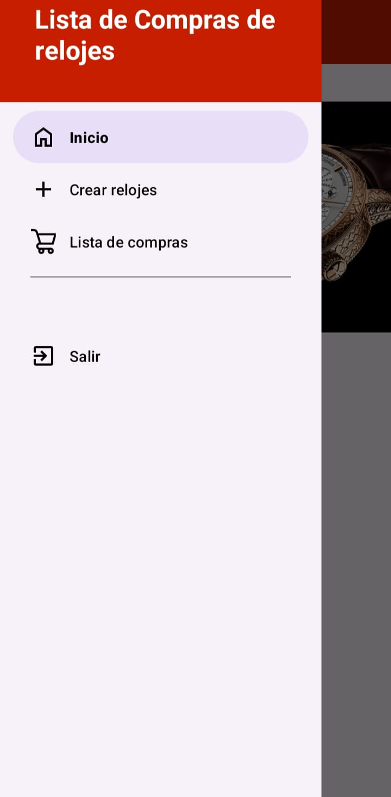
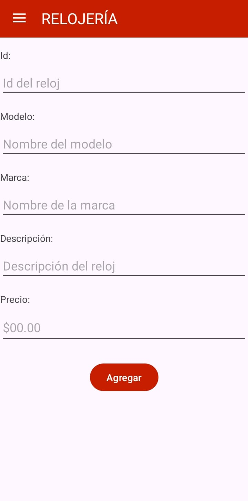
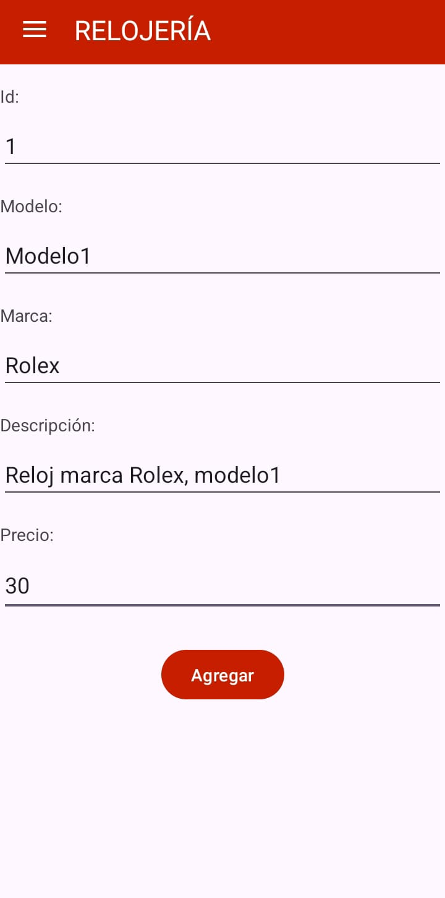
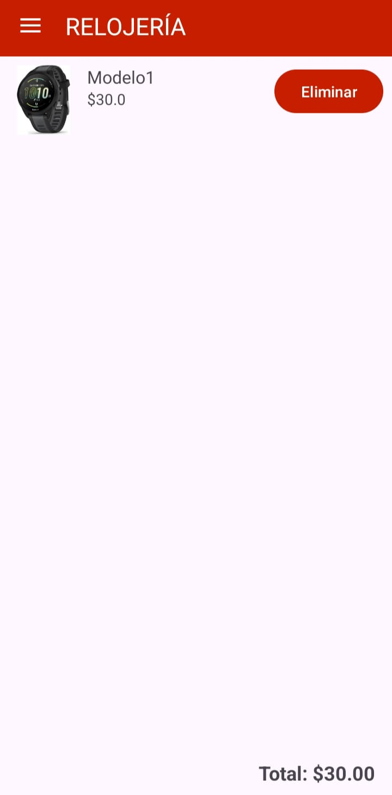
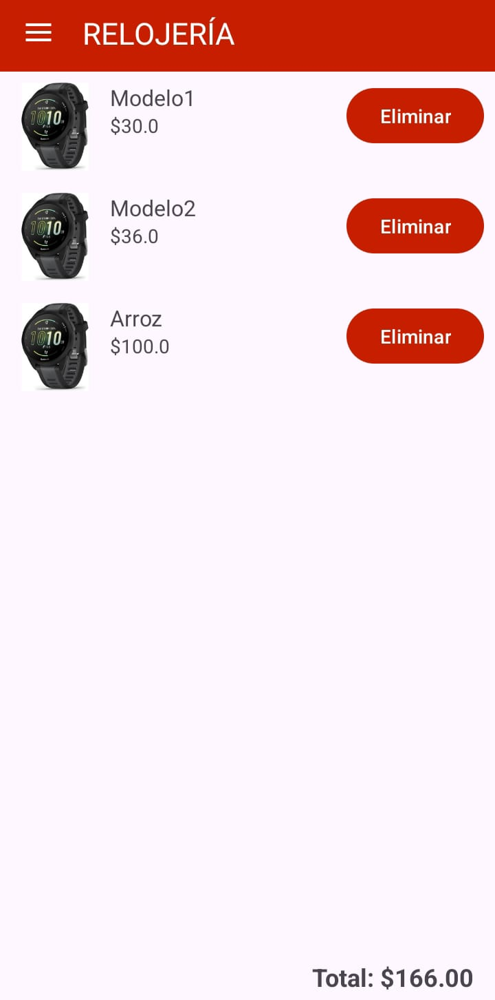

# Relojería — App de compras de relojes (Android)

**Descripción corta**      
Relojería es una app Android simple para gestionar una lista de relojes y visualizar un carrito de compras. Fue desarrollada como proyecto académico y actualmente incluye funcionalidades básicas: agregar un reloj (ID, nombre, modelo, marca, descripción, precio) y listar los relojes añadidos con su precio total. La app está en desarrollo.

---

## Demo / Estado
**Estado:** En desarrollo (funcionalidad básica implementada)  
**Demo:** [Ver video demo](docs/screenshots/gif-demo-app.mp4)  
**APK disponible:** [v0.1.0-alpha](https://github.com/aly-005/relojes-shopcart-android/releases/tag/v0.1.0-alpha)

---

## Capturas  

  
  
  
  
  
  
  

---

## Características implementadas
- Página de inicio con navegación básica.
- Agregar reloj con campos: `id`, `nombre`, `modelo`, `marca`, `descripción`, `precio`.
- Visualizar listado de relojes añadidos y sumar precio total.
- Guardado local temporal (explicar si usas un array en memoria, SharedPreferences, Room, etc.)

---

## Funcionalidades faltantes / Limitaciones actuales
- No es posible editar un reloj después de agregarlo.
- No hay persistencia permanente.
- Falta gestión de usuarios, eliminación, búsqueda/filtrado, validaciones completas.
- Interfaz y UX por pulir (animaciones, accesibilidad).

---

## Tech stack
- Lenguaje: Java
- IDE: Android Studio  
